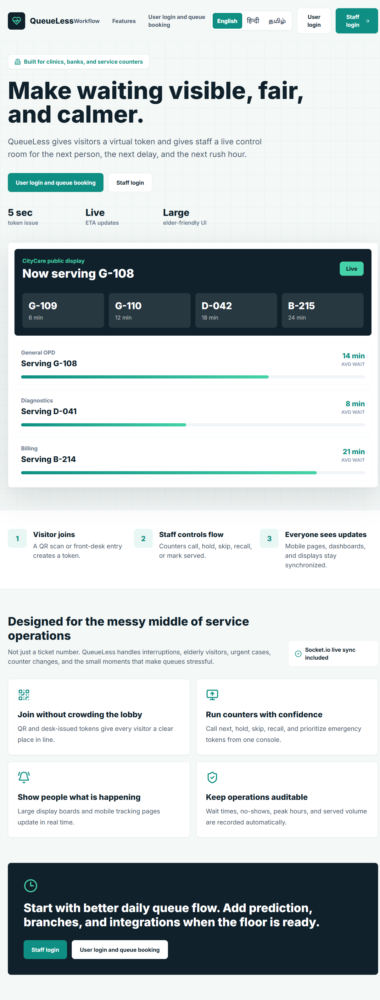
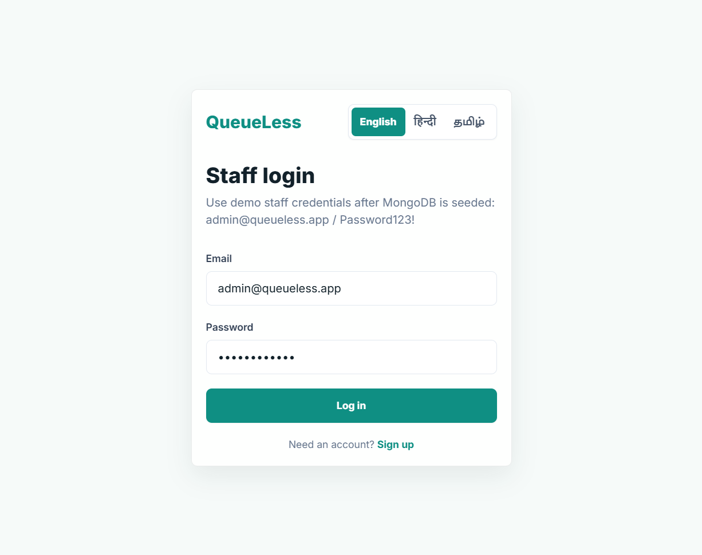
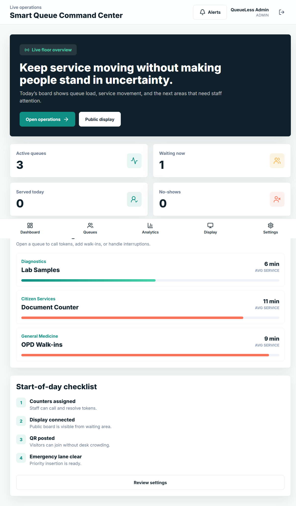
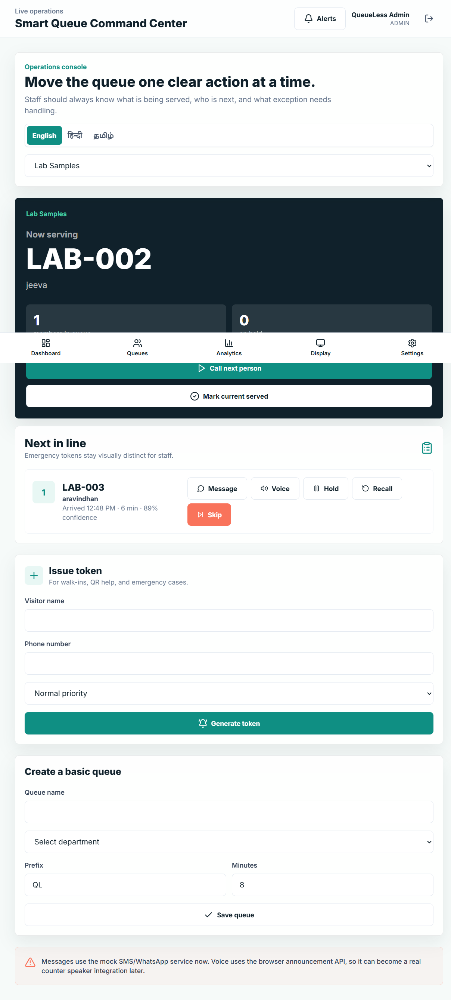
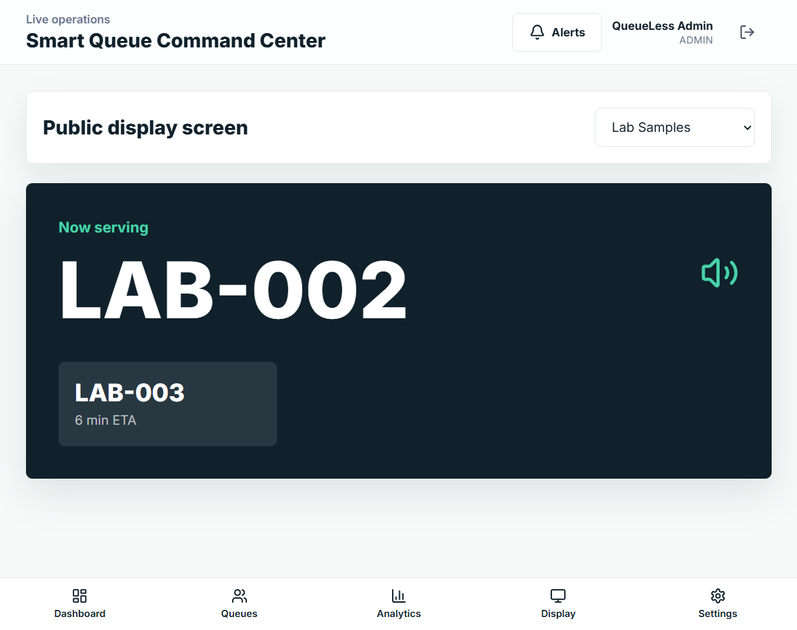
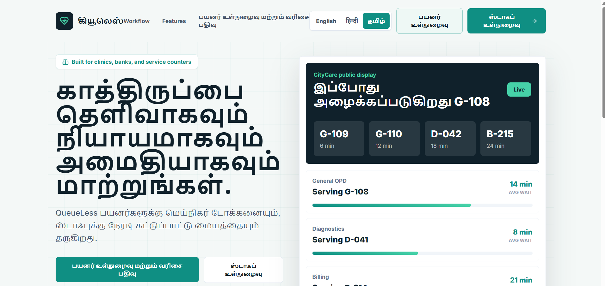

# QueueLess

QueueLess is a production-ready MERN stack smart queue management platform for hospitals, clinics, banks, government offices, and public service centers.

## Screenshots

### Landing Page



### Staff Login



### Dashboard



### Queue Operations



### Public Display



### User Token Tracking


### Hindi and Tamil Language Support




## Tech Stack

- Frontend: React, Vite, Tailwind CSS, React Router, Zustand, Recharts, Socket.io client
- Backend: Node.js, Express, MongoDB, Mongoose, JWT, bcrypt, Socket.io
- Security: Helmet, rate limiting, CORS, validation middleware
- Notifications: Mock SMS/WhatsApp abstraction ready for provider integration

## Setup

```bash
npm install
npm install --prefix backend
npm install --prefix frontend
```

Create `backend/.env`:

```bash
PORT=5000
MONGO_URI=mongodb://127.0.0.1:27017/queueless
JWT_SECRET=replace-with-a-long-secret
JWT_EXPIRES_IN=7d
CLIENT_URL=http://localhost:5173
```

Create `frontend/.env`:

```bash
VITE_API_URL=http://localhost:5000/api
VITE_SOCKET_URL=http://localhost:5000
```

Seed demo data:

```bash
npm run seed
```

Run both apps:

```bash
npm run dev
```

- Frontend: http://localhost:5173
- Backend API: http://localhost:5000/api/health

Demo admin:

- Email: `admin@queueless.app`
- Password: `Password123!`

## API Examples

```bash
curl -X POST http://localhost:5000/api/auth/login \
  -H "Content-Type: application/json" \
  -d "{\"email\":\"admin@queueless.app\",\"password\":\"Password123!\"}"
```

```bash
curl -X POST http://localhost:5000/api/tokens/join \
  -H "Content-Type: application/json" \
  -d "{\"queueId\":\"QUEUE_ID\",\"customerName\":\"Asha Mehta\",\"phone\":\"9999999999\"}"
```

## Deployment

- Backend: deploy `backend/` to Render, Railway, Fly.io, or an equivalent Node host.
- Frontend: deploy `frontend/` to Vercel/Netlify with `VITE_API_URL` and `VITE_SOCKET_URL`.
- Database: use MongoDB Atlas and set `MONGO_URI`.
- Configure CORS with the production frontend URL via `CLIENT_URL`.

## Architecture

The backend separates routes, controllers, services, models, middleware, socket publishing, and seed data. The frontend separates pages, layout, reusable UI, hooks, Zustand stores, and API/socket utilities.
